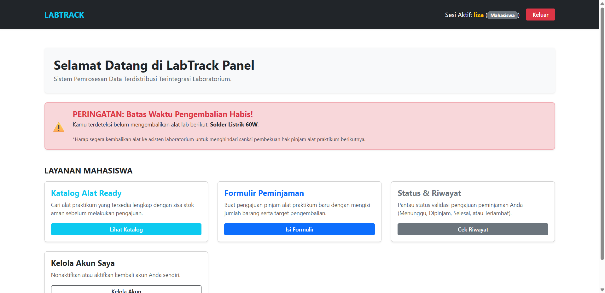
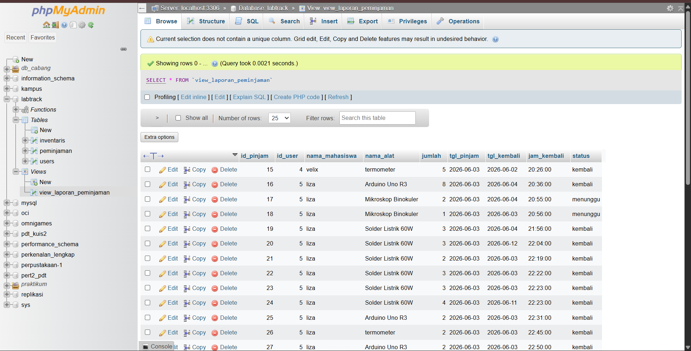
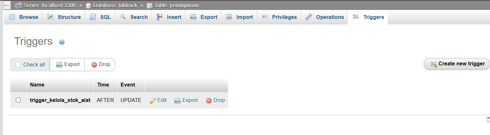
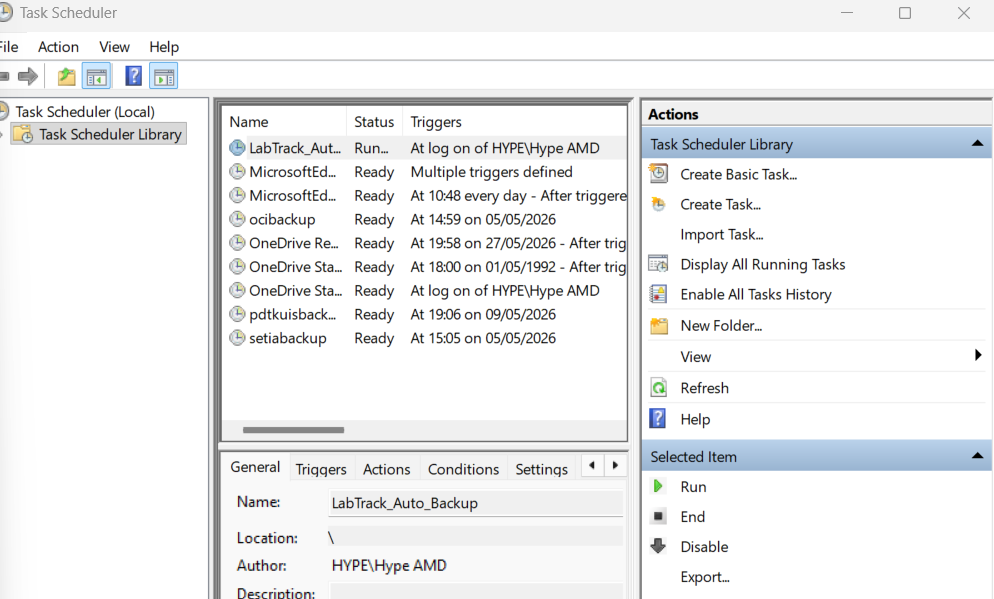

# 🔬 LabTrack (Proyek UAP)

Proyek ini merupakan sistem manajemen dan peminjaman alat laboratorium terintegrasi yang dibangun menggunakan PHP dan MySQL. Tujuannya sebagai platform pelacakan inventaris dan pengajuan alat praktikum mahasiswa dengan memanfaatkan database transaction, view, trigger, dan backup database + task scheduler. Sistem ini juga dilengkapi mekanisme backup otomatis untuk menjaga keamanan data jika terjadi hal yang tidak diinginkan.



---

## 📌 Detail Concept

### 👥 Fragmentasi Data (Arsitektur View)
Stored view bertindak sebagai lapisan abstraksi data relasional yang mengisolasi query kompleks dari kode aplikasi utama. Fragmentasi data dilakukan menggunakan SQL `VIEW` untuk menggabungkan data dari tabel `peminjaman`, `users`, dan `inventaris` secara horizontal dan vertikal.

#### 🖼️ Struktur View di Database:


#### 💻 Implementasi View (`view_laporan_peminjaman`):
Fungsi ini menyatukan data laporan transaksi agar backend admin dapat memanggil ringkasan peminjaman secara instan tanpa membebani performa server dengan query `JOIN` yang berulang-ulang:

```sql
CREATE VIEW `view_laporan_peminjaman` AS 
SELECT 
    `p`.`id_pinjam` AS `id_pinjam`, 
    `p`.`id_user` AS `id_user`, 
    `u`.`username` AS `nama_mahasiswa`, 
    `i`.`nama_alat` AS `nama_alat`, 
    `p`.`jumlah` AS `jumlah`, 
    `p`.`tgl_pinjam` AS `tgl_pinjam`, 
    `p`.`tgl_kembali` AS `tgl_kembali`, 
    `p`.`jam_kembali` AS `jam_kembali`, 
    `p`.`status` AS `status` 
FROM ((`peminjaman` `p` 
JOIN `users` `u` ON(`p`.`id_user` = `u`.`id_user`)) 
JOIN `inventaris` `i` ON(`p`.`id_alat` = `i`.`id_alat`));
🔒 Database Transaction & Race Condition Handling
Pada file form_pinjam.php, aspek konsistensi data dijaga ketat menggunakan fitur Database Transaction (mysqli_begin_transaction). Hal ini dipadukan dengan klausa FOR UPDATE untuk mencegah fenomena Race Condition atau Double Booking ketika dua mahasiswa mencoba meminjam alat yang sama di detik yang sama.

PHP
mysqli_begin_transaction($conn);

try {
    // Mengunci baris data inventaris menggunakan FOR UPDATE untuk mencegah Race Condition
    $cek_stok = mysqli_query($conn, "SELECT stok FROM inventaris WHERE id_alat = '$id_alat' FOR UPDATE");
    $data_stok = mysqli_fetch_assoc($cek_stok);

    if ($data_stok['stok'] < $jumlah) {
        echo "<script>alert('Stok alat tidak mencukupi!');</script>";
    } else {
        // Eksekusi insert data ke tabel transaksi peminjaman
        $query = "INSERT INTO peminjaman (id_user, id_alat, jumlah, tgl_pinjam, jam_pinjam, jam_kembali, tgl_kembali, status) 
                  VALUES ('$id_user', '$id_alat', '$jumlah', '$tgl_pinjam', '$jam_pinjam', '$jam_kembali', '$tgl_kembali', 'menunggu')";
        
        if (mysqli_query($conn, $query)) {
            // Jika semua operasi sukses, simpan perubahan secara permanen
            mysqli_commit($conn);
            echo "<script>alert('Peminjaman berhasil diajukan!'); window.location='riwayat.php';</script>";
        } else {
            throw new Exception("Gagal melakukan input data peminjaman.");
        }
    }
} catch (Exception $e) {
    // Jika di tengah jalan terjadi error, batalkan semua perubahan (Rollback) untuk menjaga integritas data
    mysqli_rollback($conn);
    echo "<script>alert('Terjadi kesalahan: " . $e->getMessage() . "');</script>";
}
FOR UPDATE : Memblokir akses read/write proses lain pada baris alat yang sedang diperiksa hingga transaksi selesai berjalan.

mysqli_commit() : Menandakan bahwa seluruh rangkaian proses (pengecekan dan pengisian data) valid dan diaplikasikan ke database.

mysqli_rollback() : Berfungsi mengembalikan database ke keadaan semula jika salah satu query gagal, menghindari adanya data transaksi yang menggantung.


⚡ Database Triggers


trigger_kelola_stok_alat : Trigger ini bertindak langsung di lapisan DBMS untuk mengotomatisasi sinkronisasi data kuantitas inventaris tanpa perlu menulis query UPDATE manual di dalam kode PHP script aplikasi:

Kondisi dipinjam : Mengurangi kuantitas stok alat di tabel inventaris secara otomatis begitu admin mengubah status peminjaman mahasiswa menjadi disetujui.

Kondisi kembali : Mengembalikan kuantitas stok alat ke tabel inventaris saat mahasiswa memulangkan alat laboratorium secara fisik.

🖼️ Struktur Trigger di Database:
SQL
BEGIN
    -- Logika otomatisasi pengurangan stok alat lab
    IF NEW.status = 'dipinjam' AND OLD.status <> 'dipinjam' THEN
        UPDATE `inventaris` 
        SET `stok` = `stok` - NEW.jumlah
        WHERE `id_alat` = NEW.id_alat;
        
    -- Logika otomatisasi pemulangan stok alat lab
    ELSEIF NEW.status = 'kembali' AND OLD.status <> 'kembali' THEN
        UPDATE `inventaris` 
        SET `stok` = `stok` + NEW.jumlah
        WHERE `id_alat` = NEW.id_alat;
    END IF;
END
💾 Backup Otomatis



Untuk menjaga ketersediaan (availability) dan keamanan data, sistem ini dilengkapi fitur backup otomatis berbasis skrip PHP native dan Windows Task Scheduler. Backup dilakukan secara berkala dan hasilnya disimpan dengan nama file yang mencakup komponen timestamp, sehingga mudah ditelusuri. Semua berkas cadangan disimpan di dalam direktori terlindung /backups dan status eksekusinya dicatat secara real-time pada file task_scheduler_log.txt.

🖼️ Tampilan Windows Task Scheduler:
📄 cron_backup.php
Skrip backend structured native yang bertugas membaca seluruh tabel operasional database (mengecualikan komponen virtual views) dan menyusun ulang struktur DDL (SHOW CREATE TABLE) serta query DML (INSERT INTO) ke dalam format file .sql:

PHP
<?php
$host     = "localhost";
$username = "root";
$password = ""; 
$dbname   = "labtrack";

$backup_dir = __DIR__ . '/backups/';
if (!is_dir($backup_dir)) {
    mkdir($backup_dir, 0777, true);
}

$file_name   = 'labtrack_auto_scheduled_' . date('Y-m-d_H-i-s') . '.sql';
$backup_file = $backup_dir . $file_name;

$conn = mysqli_connect($host, $username, $password, $dbname);
if (!$conn) {
    file_put_contents(__DIR__ . '/task_scheduler_log.txt', "[" . date('Y-m-d H:i:s') . "] FAILED: Connection error.\n", FILE_APPEND);
    exit();
}

$tables = array();
$result = mysqli_query($conn, "SHOW TABLES");
while ($row = mysqli_fetch_row($result)) {
    $tables[] = $row[0];
}

$sql_content = "-- LabTrack Database Automatic Scheduled Backup\n\n";
foreach ($tables as $table) {
    if (strpos($table, 'view_') === 0) continue;
    $result = mysqli_query($conn, "SELECT * FROM $table");
    $num_fields = mysqli_num_fields($result);
    
    $sql_content .= "DROP TABLE IF EXISTS `$table`;\n";
    $row2 = mysqli_fetch_row(mysqli_query($conn, "SHOW CREATE TABLE $table"));
    $sql_content .= $row2[1] . ";\n\n";
    
    for ($i = 0; $i < $num_fields; $i++) {
        while ($row = mysqli_fetch_row($result)) {
            $sql_content .= "INSERT INTO `$table` VALUES(";
            for ($j = 0; $j < $num_fields; $j++) {
                $row[$j] = addslashes($row[$j]);
                if (isset($row[$j])) { $sql_content .= '"' . $row[$j] . '"'; } else { $sql_content .= 'NULL'; }
                if ($j < ($num_fields - 1)) { $sql_content .= ','; }
            }
            $sql_content .= ");\n";
        }
    }
    $sql_content .= "\n\n";
}

file_put_contents($backup_file, $sql_content);
file_put_contents(__DIR__ . '/task_scheduler_log.txt', "[" . date('Y-m-d H:i:s') . "] SUCCESS: " . $file_name . "\n", FILE_APPEND);
echo "Success";
?>
📄 run.backup.bat
Berkas batch Windows executable yang menjembatani otomasi CLI untuk mengarahkan interpreter PHP environment lokal agar dapat mengeksekusi skrip backup secara terjadwal:

Cuplikan kode
@echo off

cd /d "C:\xampp\php"

php.exe -f "C:\Users\Hype AMD\OneDrive\Documents\PDT_Projek\cron_backup.php"

exit