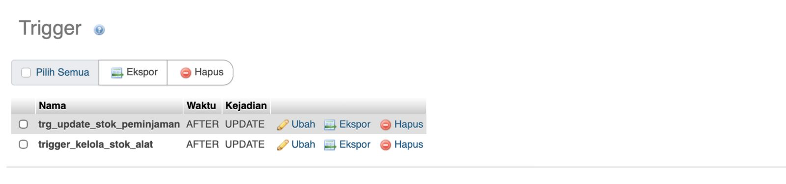
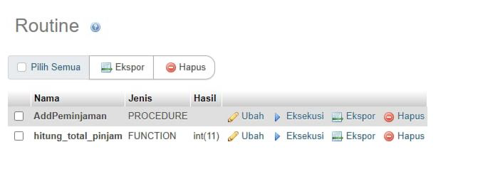

# 🧪 LabTrack (Proyek UAP)

LabTrack merupakan sistem manajemen peminjaman alat laboratorium yang dibangun menggunakan **PHP** dan **MySQL**. Sistem ini bertujuan untuk membantu pengelolaan data alat laboratorium, proses peminjaman, monitoring pengguna, serta pembuatan laporan peminjaman secara lebih terstruktur dan efisien.

Selain itu, sistem ini juga mengimplementasikan konsep **stored procedure, function, trigger, fragmentasi data, view**, serta **backup database otomatis menggunakan task scheduler** untuk menjaga integritas dan keamanan data.


<h1>📌 Detail Konsep</h1>

👣 **Stored Procedure** digunakan untuk mengelola proses utama pada sistem, seperti pengolahan data peminjaman dan validasi transaksi. Procedure disimpan langsung pada database untuk meningkatkan efisiensi, konsistensi, dan keamanan proses pada sistem multi-user.

👣 **Function** digunakan untuk membantu proses validasi data, seperti pengecekan status alat atau kebutuhan tertentu sebelum transaksi dijalankan.

👣 **Trigger** digunakan untuk menjaga konsistensi data secara otomatis, terutama pada proses peminjaman alat agar status inventaris selalu diperbarui sesuai kondisi transaksi.

👣 **Fragmentasi Data** diterapkan pada pengelolaan inventaris untuk meningkatkan efisiensi akses data serta mendukung konsep basis data terdistribusi pada sistem.

👣 **View** digunakan untuk menghasilkan laporan peminjaman sehingga proses monitoring data menjadi lebih mudah dan terstruktur.




### Beberapa Procedure, Function, dan Trigger yang digunakan:

`peminjaman.php`

#### Stored Procedure

`AddPeminjaman(p_mhs, p_alat, p_jml, p_kembali)`

Procedure ini digunakan untuk menambahkan data peminjaman alat laboratorium ke dalam tabel `peminjaman`.

```sql
BEGIN
    INSERT INTO peminjaman (
         nama_mahasiswa,
        id_alat,
        jumlah,
        tgl_kembali,
        status,
        tgl_pinjam
    )
    VALUES (
        p_mhs,
        p_alat,
        p_jml,
        p_kembali,
        'dipinjam',
        NOW()
    );
END
```

#### Function

`hitung_total_pinjam(p_id_user)`

Function ini digunakan untuk menghitung total jumlah alat yang sedang dipinjam oleh pengguna tertentu.

Function akan menjumlahkan data peminjaman dengan status `dipinjam` atau `terlambat`.

```sql
BEGIN
    DECLARE total_barang INT DEFAULT 0;
    
    SELECT IFNULL(SUM(jumlah), 0)
    INTO total_barang 
    FROM peminjaman 
    WHERE id_user = p_id_user
    AND status IN ('dipinjam', 'terlambat');
    
    RETURN total_barang;
END
```

#### Trigger

`trg_update_status_inventaris`


Trigger ini digunakan untuk menjaga konsistensi stok inventaris secara otomatis ketika alat laboratorium dikembalikan.

Ketika status peminjaman berubah menjadi kembali, sistem akan secara otomatis menambahkan kembali jumlah stok alat pada tabel inventaris.

Trigger hanya akan dijalankan apabila:

* Status baru = kembali
* Status sebelumnya ≠ kembali

Hal ini bertujuan untuk mencegah duplikasi penambahan stok akibat perubahan data berulang.

```sql
BEGIN
    -- Jika status berubah menjadi 'kembali', tambahkan stok alat
    IF NEW.status = 'kembali' AND OLD.status != 'kembali' THEN
        UPDATE inventaris 
        SET stok = stok + NEW.jumlah 
        WHERE id = NEW.id_alat;
    END IF;
END
```
`trigger_kelola_stok_alat`

Trigger ini digunakan untuk mengelola stok inventaris alat laboratorium secara otomatis berdasarkan perubahan status peminjaman.

Trigger akan:

* Mengurangi stok alat ketika status berubah menjadi dipinjam
* Menambahkan kembali stok alat ketika status berubah menjadi kembali

Sistem hanya akan menjalankan perubahan stok apabila status benar-benar berubah, sehingga dapat mencegah duplikasi update data.

```sql
BEGIN
    -- Mengurangi stok HANYA jika status berubah menjadi 'dipinjam' dan sebelumnya BUKAN 'dipinjam'
    IF NEW.status = 'dipinjam' AND OLD.status <> 'dipinjam' THEN
        UPDATE `inventaris` 
        SET `stok` = `stok` - NEW.jumlah
        WHERE `id_alat` = NEW.id_alat;
        
    -- Menambah stok HANYA jika status berubah menjadi 'kembali' dan sebelumnya BUKAN 'kembali'
    ELSEIF NEW.status = 'kembali' AND OLD.status <> 'kembali' THEN
        UPDATE `inventaris` 
        SET `stok` = `stok` + NEW.jumlah
        WHERE `id_alat` = NEW.id_alat;
    END IF;
END
```

## 📊 View Laporan Peminjaman

Sistem menggunakan `view_laporan_peminjaman` untuk mempermudah proses monitoring dan pelaporan data peminjaman alat laboratorium.

View ini digunakan untuk menampilkan data peminjaman secara lebih terstruktur melalui hasil penggabungan (*join*) beberapa tabel yang berkaitan, seperti:

* Data mahasiswa/pengguna
* Data inventaris alat laboratorium
* Jumlah alat yang dipinjam
* Status peminjaman
* Tanggal peminjaman dan pengembalian

Dengan adanya *view*, proses pembuatan laporan menjadi lebih cepat, efisien, dan mengurangi kebutuhan penulisan query kompleks secara berulang.

---

## 💾 Backup Otomatis

Untuk menjaga keamanan dan ketersediaan data, sistem dilengkapi fitur **backup database otomatis** menggunakan `mysqldump` dan **Windows Task Scheduler**.

Backup dijalankan melalui file:

* `cron_backup.php`
* `run.backup.bat`

Hasil backup akan disimpan secara otomatis dengan nama file berdasarkan **timestamp**, sehingga memudahkan proses identifikasi dan pelacakan file cadangan database.

Aktivitas backup juga dicatat pada file log:

```bash
task_scheduler_log.txt
```

Fitur ini bertujuan untuk mengantisipasi kehilangan data akibat kesalahan sistem, kerusakan database, maupun kegagalan perangkat.

---

## 🛠️ Teknologi yang Digunakan

* **Frontend** : HTML, CSS, Bootstrap
* **Backend** : PHP Native
* **Database** : MySQL
* **Server** : XAMPP/LARAGON
* **Database Tools** : phpMyAdmin
* **Code Editor** : Visual Studio Code

---

## 👥 Role Pengguna

### Admin

Admin memiliki akses penuh terhadap sistem, meliputi:

* Mengelola data pengguna
* Mengelola data inventaris alat laboratorium
* Mengelola data peminjaman
* Memantau laporan peminjaman
* Menjalankan dan memonitor backup database

### User / Mahasiswa

Pengguna dapat melakukan aktivitas berikut:

* Login ke sistem
* Melakukan peminjaman alat laboratorium
* Melihat status peminjaman alat

---

## 📂 Struktur Database

Database LabTrack terdiri dari beberapa tabel utama:

* `users`
* `peminjaman`
* `inventaris`

Sistem juga menggunakan:

* `view_laporan_peminjaman` untuk pelaporan data peminjaman

Selain itu, sistem mengimplementasikan konsep:

✅ Stored Procedure (`AddPeminjaman`)
✅ Function (`hitung_total_pinjam`)
✅ Trigger (`trigger_kelola_stok_alat`)
✅ View Database
✅ Fragmentasi Data pada Inventaris
✅ Backup Database Otomatis menggunakan Task Scheduler